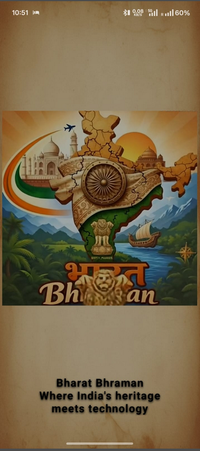
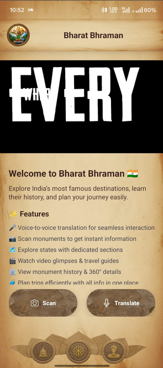
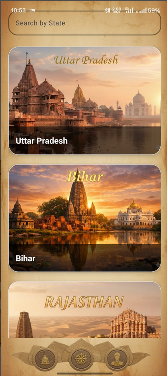
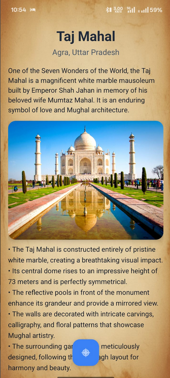
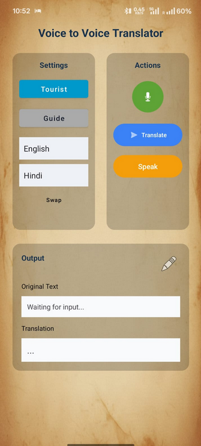

# Bharat Bhraman – AI Tourism Android App

Bharat Bhraman is an AI-powered tourism Android application built using Kotlin, Firebase, and Gemini API. The application helps users explore Indian monuments and tourist destinations through AI-based monument scanning, multilingual voice translation, and immersive tourism experiences.

## Features

* AI-based monument scanning using Gemini API
* Multilingual voice-to-voice translation
* Firebase Authentication and cloud database integration
* Biometric app security
* Interactive tourism exploration
* 360° monument viewing experience
* Google Maps integration for navigation and location services

## Screenshots

## Screenshots

## Screenshots

  
  
  
  
  

## Tech Stack

* Kotlin
* Android Studio
* Firebase Authentication
* Firebase Realtime Database
* Gemini API
* Google Maps API

## Play Store

https://play.google.com/store/apps/details?id=dev.shahil.bharatbhraman

## Installation

1. Clone the repository
2. Open the project in Android Studio
3. Add your own `google-services.json` file
4. Sync Gradle and run the application

## Note

Firebase configuration files and API keys are excluded from this repository for security purposes.
